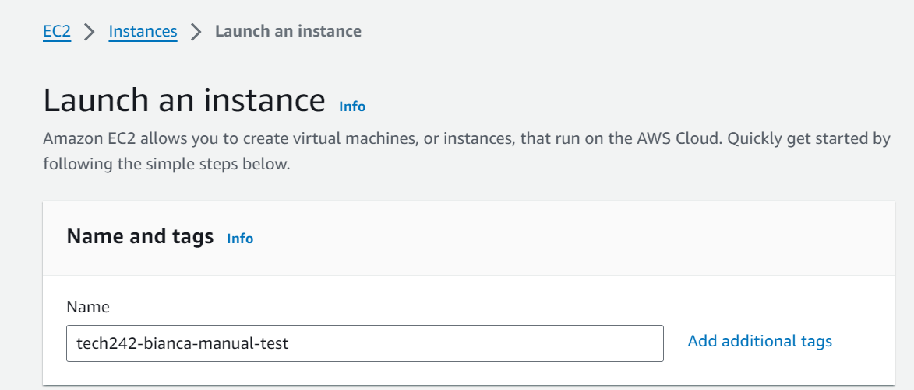

# Creating a Virtual Machine on AWS

In a past project, I needed to set up a virtual machine (VM) on Amazon Web Services (AWS) to facilitate various tasks. Below are the steps I followed to create a VM on AWS.


## Step 1: Sign in to the AWS Console
Opened browser and navigated to the AWS Management Console. Loged in using Sparta Global AWS account credentials.

## Step 2: Navigate to EC2 Dashboard
In the AWS Management Console, selected the "EC2" service. This took me to the EC2 Dashboard.

## Step 3: Launch an Instance
1. On the EC2 Dashboard, clicked the "Instances" link on the left-hand side.
2. Click the "Launch Instance" button.
3. Always follow the proper naming convention while creating the Name and Tags.



## Step 4: Choose an Amazon Machine Image (AMI)
1. Selected an AMI based on requirements:
 ```
- Filter for 20230424

- Choose the image with AMI ID ending with 1e9
 ```

 


2. Clicked the "Next: Configure Instance Details" button.

## Step 5: Configure Instance Details
1. Set the desired number of instances.
2. Configured networking options.


## Step 6: Configure Security Group
1. Created a new security group 


2. Added some extra advanced settings:


## Step 7: Review and Launch
Reviewed instance configuration. If everything looks good, click the "Launch" button.

## Step 8: Select  a Key Pair
1. Choosed an existing key pair 
2. Downloaded the key pair and keeped it in the ssh file

## Step 11: Git Bash
1. Connected the VM 
2. Logged in
3. To execute Linux commands on the VM, refer to the log [Linux Commands](LINUXcommands.md)
4. Exit the VM when done

## Step 12: Stop the VM when on break or end of the workday
1. Go on the E2 section from the main page on AWS
2. Go on instances
3. Select my VM tech242-bianca-first-vm
4. Click on instance state and press the stop instance.
