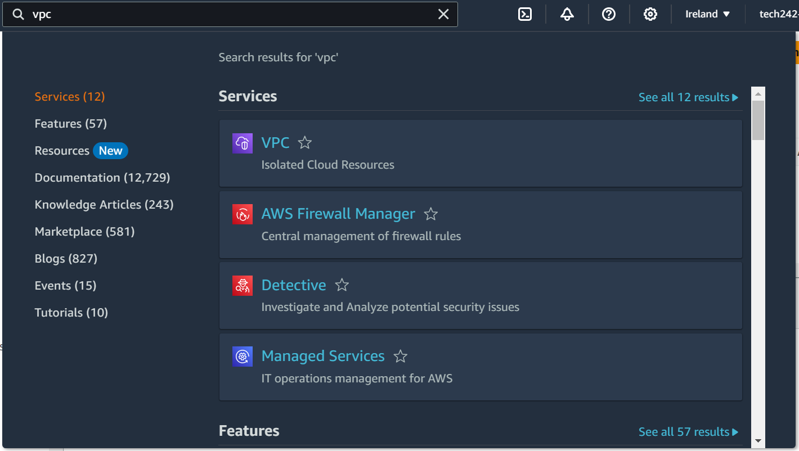
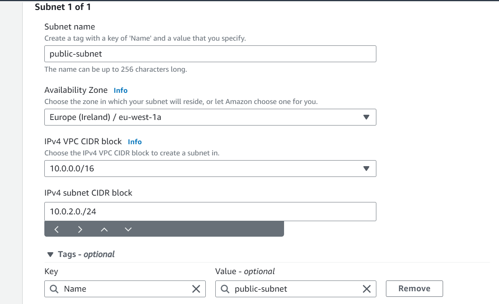
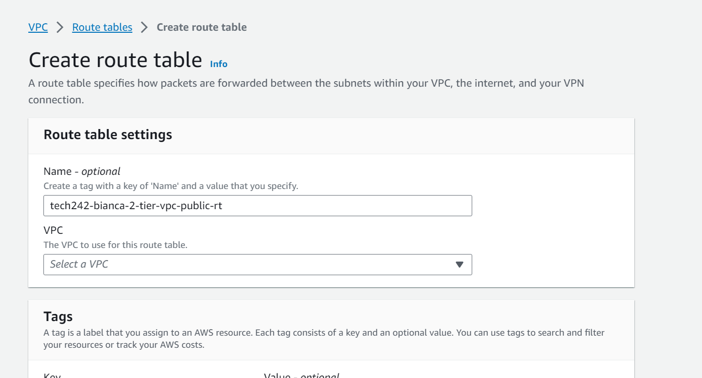
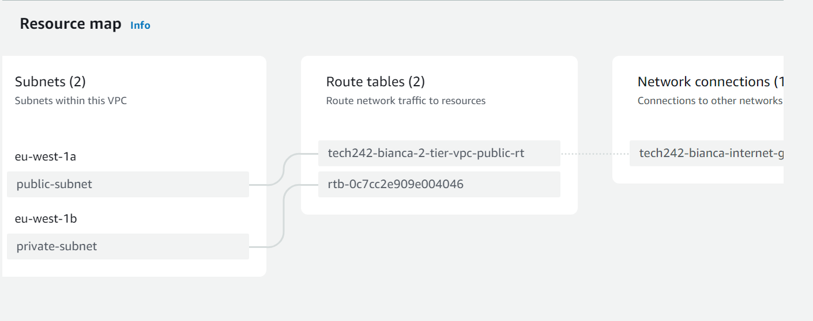

## Step 1. Create the VPC

### Go into the EC2 in AWS and in the search bar, look for VPC and choose the first option:

### Choose "Create VPC"

### We have to provide appropiate name for our VPC and CIDR has to be on manual:

### VPC succesfully created

## Step 2. Create 2 subnets: public and private

### First connect it to the correct VPC:

### Create first subnet:

### Create second subnet:

## Step 3. Internet Gateway

### Create a new internet gateway and provide appropriate name to it.

## Step 4. Attach an Internet Gateway to the VPC

## Step 5. Create the Public IP 

## Step 6. Public route table

### Create new route:

## Step 7. Associate the route with subnet

### When you successfully created the route:

### Go down and press "Subnet associations"

### Select the subnet, in our case the public subnet:

## Step 8. Add Internet Gateway to the route

## Step 9. Check that the VPC setup was set according to our expectations

## Step 10. Create the Database VM

## Step 11. Create the API VM