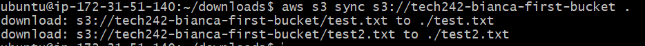
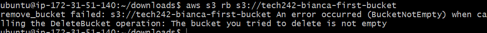
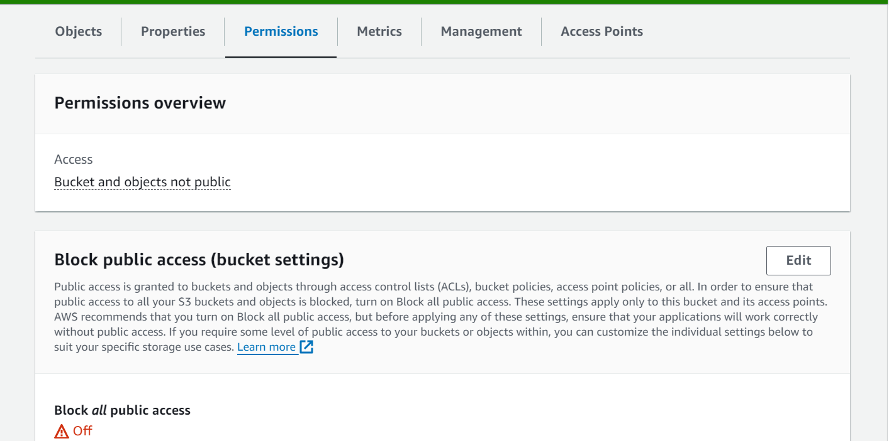

# AWS S3

### Our session started with a process involving the manipulation of a cat image stored in AWS S3 storage. Our trainer mentioned uploading the cat image to an S3 bucket, changing the displayed image on a webpage, and then providing a script to revert these changes. The demonstration involves running the script, checking the updated image on the webpage, and verifying the changes on AWS S3 storage. The scripts also handle the removal of the cat image and the bucket, showcasing the complete process. Additionally, we discussed the terminology used in AWS (e.g., bucket, object) and emphasizes the importance of AWS security and credentials, including the use of access keys. We were guided on where to store these credentials and instructed on installing the AWS CLI. 

## Follow these steps to set up and use the AWS CLI for managing S3 buckets:

### Step 1: Install AWS CLI
Make sure you have the AWS CLI installed. If not, you can install it using the following command:

```
sudo apt install awscli -y
```

### Step 2: Configure AWS CLI
Run the following command to configure the AWS CLI with your access key and secret access key:

```
    aws configure
```

- Provide the requested information, including Access Key ID and Secret Access Key. Note that the access key is stored in the .ssh folder.
- For the default region, follow this template:
  
 

### Step 3: Check Credentials
Verify your AWS credentials by running:
```
aws s3 ls
```

This command should list the S3 buckets.

### Step 4: Create a Bucket
To create an S3 bucket, use the following command:
```
aws s3 mb s3://tech242-bianca-first-bucket
```

Ensure the bucket name is in lowercase!

### Step 5: Check Bucket
Verify if the bucket was created:
```
aws s3 ls
```

### Step 6: Check Bucket Contents
Check what is in your bucket:
```
aws s3 ls s3://tech242-bianca-first-bucket
```

### Step 7: Redirect Echo into a File
Use echo to redirect content into a file:
```
echo "Sample content" > test.txt
```

### Step 8: Upload File to Bucket
Upload the test.txt file to your bucket:
```
aws s3 cp test.txt s3://tech242-bianca-first-bucket
```

Outcome:


### Step 9: Check Upload Success
Verify if the test.txt file was successfully uploaded:
```
aws s3 ls s3://tech242-bianca-first-bucket
```

### Step 10: Download Files from Bucket
- Download files from your bucket as needed.
- Outcome:




### Step 11: Delete File from Bucket
Delete a specific file from your bucket:
```
aws s3 rm s3://tech242-bianca-first-bucket/test.txt
```

### Step 12: Delete All Files in Bucket
Delete all files from your bucket:
```
aws s3 rm s3://tech242-bianca-first-bucket --recursive
```

### Step 13: Delete Bucket
To delete a bucket with items, use the following command:
```
aws s3 rb s3://tech242-bianca-first-bucket --force
```
This will remove the bucket and all objects within it.



## Follow these steps to modify access permissions for the public

### Step 1: Find your bucket and click on the link. Then click on the test.txt file to modify its' permissions



### Step 2: 
Modify the access control


### Step 3. Select the object that you want to modify
This will modify individually each object so that we can have control which file should be prublic or private!

[Alt text](<../readme-images/today/access step 2.png>)

### Step 4. Go back to the object


### Step 5: 


### Step 6. 
Choose the second option and accept the terms and conditions!