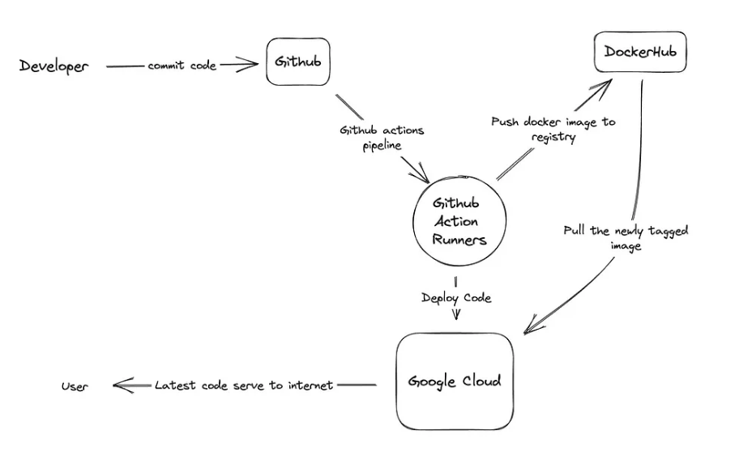

# DevOps CICD Basics

## What is CI (Continuous Integration)?
- CI stands for Continuous Integration.
- Developers regularly merge code changes into a central repository.
- Goal: Detect and fix integration issues early in development.

## What is CD (Continuous Delivery/Deployment)?
- CD stands for Continuous Delivery or Continuous Deployment.
- Continuous Delivery ensures reliable and rapid delivery of code changes.
- Continuous Deployment automatically deploys code changes to production after passing tests.

## Difference between CD and CDE
- CD:
  - CD is primarily concerned with the methodology and practices involved in delivering code changes reliably and efficiently.
  - It embodies the principles of automation, testing, and structured release processes.

- CDE:
  - CDE expands the scope to include the entire ecosystem of tools, infrastructure, and components that work together to facilitate continuous deployment.
  - It aims to create an environment where the CD process operates seamlessly, allowing for frequent and reliable deployment of software changes.
  
The takeaway: In simple terms, CD is the cooking process, and CDE is having the right kitchen setup to make that process easy and successful.

## What is Jenkins?
- An open-source automation server.
- Jenkins is a tool that helps automate tasks like building and deploying code changes.

## Why Jenkins?

- **Benefits:**
  - Saves time by doing repetitive tasks.
  - Adaptable to different workflows.
  - Can be customized with plugins.

- **Disadvantages:**
  - Can be a bit tricky to set up.
  - Uses a good amount of computer resources.

## Stages of Jenkins
- Jenkins typically involves stages such as:
  - Checkout: Fetching source code from the version control system.
  - Build: Compiling code and generating executable artifacts.
  - Test: Running automated tests to ensure code quality.
  - Deploy: Deploying the application to testing or production environments.

## What alternatives are there for Jenkins?
- **Popular alternatives include:**
  - GitLab CI/CD: Integrated with GitLab, providing a complete DevOps platform.
  - Travis CI: Cloud-based CI/CD service with straightforward setup.
  - CircleCI: Cloud-based CI/CD platform with a focus on speed.

## Why build a pipeline? Business value?
- A pipeline helps deploy code consistently and quickly.
- It makes sure the code is good quality.
- Saves time, helps catch issues early, and gets features to users faster.

CICD Diagram:
