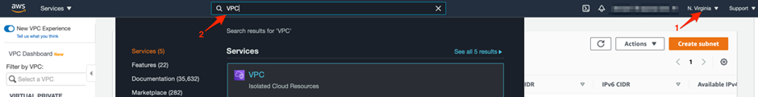
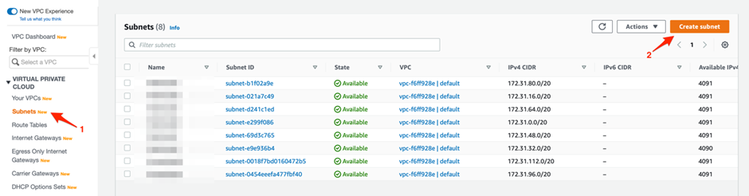
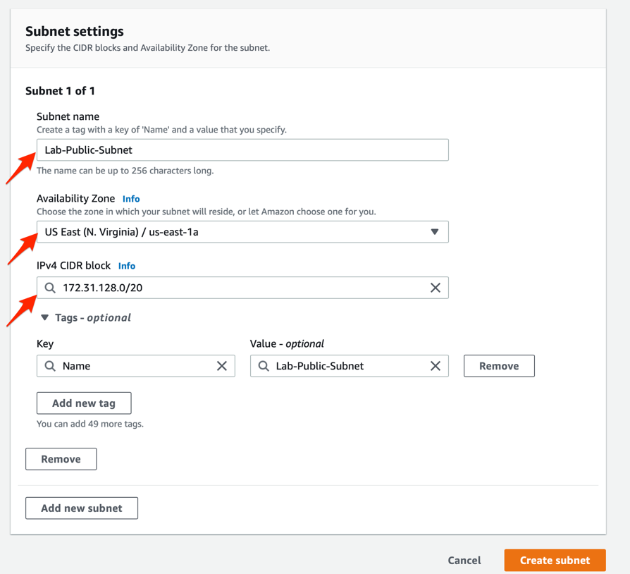
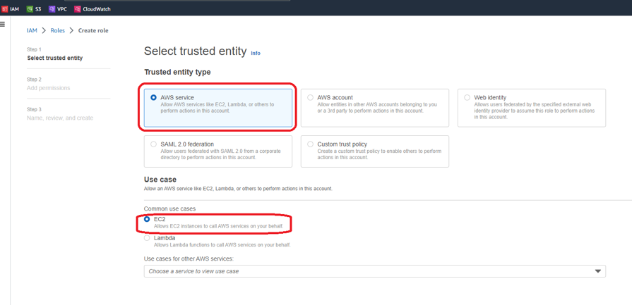
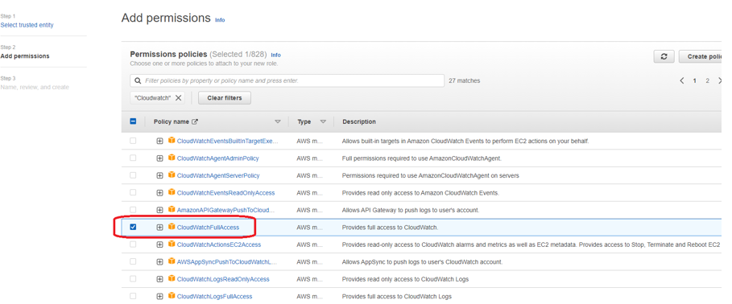
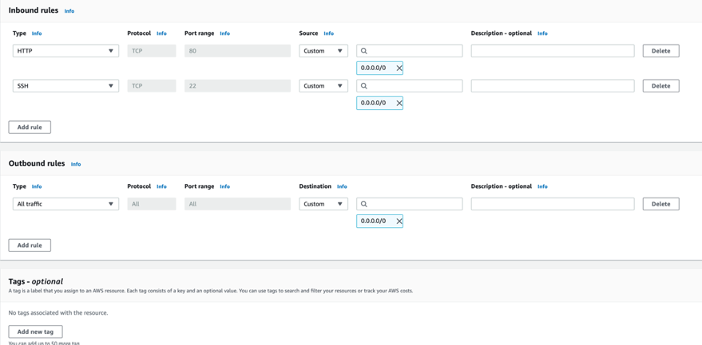
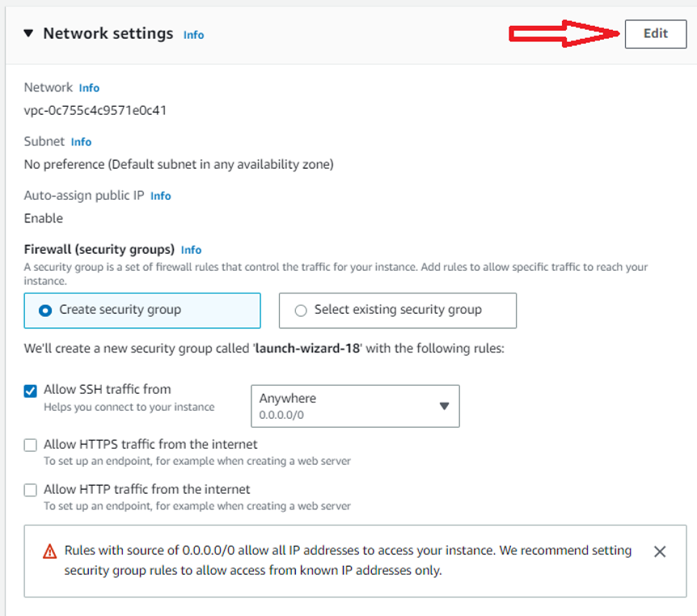
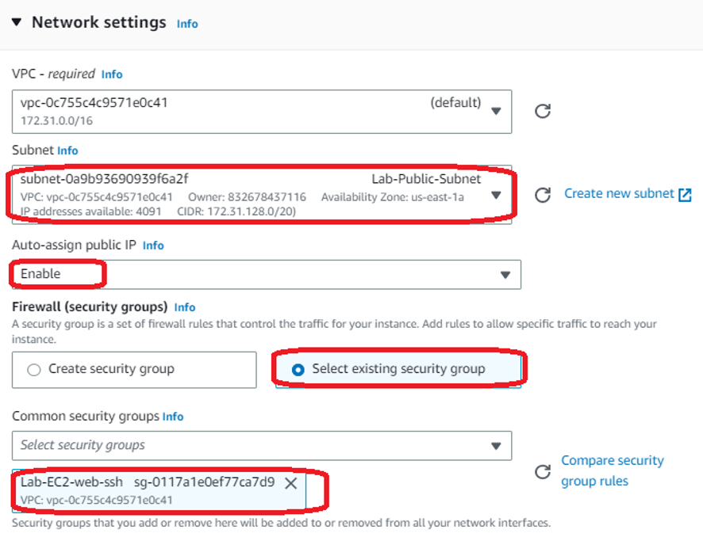

# Launch EC2 instance that acts as the frontend of the system
- Create a public subnet in the default VPC
- Create a service role for EC2 instance to invoke a CloudWatch alarm for simulating a hardware failure
- Create a security group that would allow users to SSH into the instance and also allow HTTP connections into the instance
- Launch an EC2 instance in the public subnet that acts as the frontend of the system. The EC2 instance will connect to a Multi-AZ RDS database in a private subnet

1. Make sure that you are in the N.Virginia AWS Region on the AWS Management Console. Enter VPC in the search bar and select VPC service

2. Select Subnets from the left sidebar and click Create subnet

3. Create the subnet by filling in the Subnet name as Lab-Public-Subnet, select the Availability Zone as us-east-1a and enter the value for IPv4 CIDR block as 172.31.128.0/20

4. To create the service role for the EC2 instance, you need to navigate to the IAM service. Enter IAM in the search bar and select IAM service > Click on Roles > Click on Create roles 

5.	Select AWS Service as the type of trusted entity and choose EC2 as the service

6.	Enter CloudWatchFullAccess in the search bar for permissions policies and Select CloudWatchFullAccess from the results. Click on Next

7.	Enter Role Name as LabEC2CloudWatchRole and Role description as "Allows EC2 instances to call CloudWatch services on your behalf"

8.	Create the security group for the EC2 instance.
  - Navigate back to EC2 service on the AWS console > select Security Groups from the left sidebar
  - Click on the Create security group button
  - Enter Security group name as Lab-EC2-web-ssh, enter Description as Lab-EC2-web-ssh and then select your default VPC
  - Create Inbound rules for HTTP port 80 and SSH port 22 from any source like so. Note - For production systems, should allow SSH only from own public IP. Make sure that there is an outbound rule that allows all traffic to any destination
  
  - Click on the Create security group button

9.	With all the building blocks in place, lets provision the EC2 Instance.
   - Navigate to EC2 service on AWS Console > click on Launch instances button > select the Launch instance option
   - Choose a name for the EC2 instance
   - Choose Amazon Linux 2 AMI and select t2.micro as the instance type
   - Proceed without a key-pair as we shall use EC2 connect for connecting to the instance later
   - In the Network setting tab, click on the Edit button
   
   - Set the following options: (Subnet :  Lab-Public-Subnet) (Auto-assign Public IP: Enable) (Security group :  Lab-EC2-web-ssh)

   - Expand the Advanced details section and click on the IAM instance profile dropdown and select the value LabEC2CloudWatchRole. Leave all other values as unchanged.
   - Click on the Launch instance button to finish the set-up for the instance.
 

