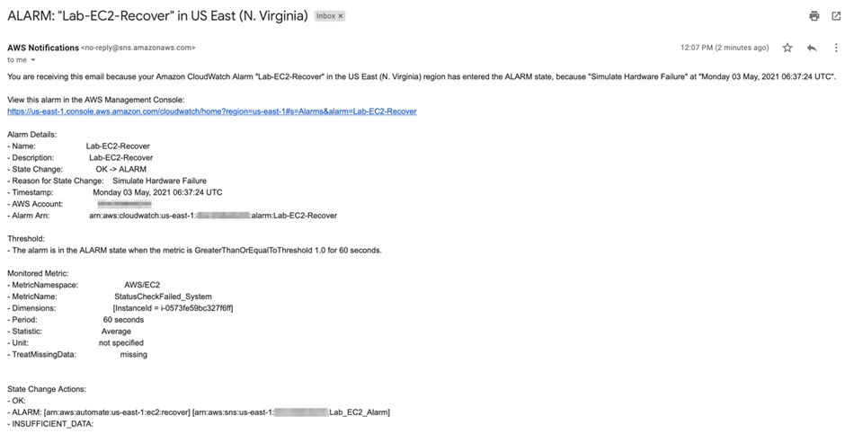

# Task 4: Simulate hardware failure for EC2 instance to kick-off EC2 auto-recovery
- Will need to use AWS command line to simulate hardware failure for the EC2 instance. This would trigger a CloudWatch event to kick-off the auto-recovery procedure to get the EC2 instance up and running again.

## 1.	Navigate to the EC2 service on AWS Console and click on Instances from the left sidebar. Select the instance you created in Task 1. Click on the Connect button

 
Select the EC2 Instance Connect tab and then click on Connect button to SSH into the instance

 
## 2.	Lets configure AWS CLI on this EC2 instance. You should never use the IAM user Access Key ID and Secret Access Key to configure AWS command line tools on an EC2 instance. As the EC2 instance profile is configured with the role LabEC2CloudWatchRole, so the instance will use this role for the AWS CLI commands. Type `aws configure` on the command line and press enter. Again just press enter when prompted for both the AWS Access Key ID and AWS Secret Access Key. Enter `us-east-1` for Default region name. Just press enter for the Default output format.

 
## 3.	Lets simulate the hardware failure on the EC2 instance.

a.	We shall trigger the CloudWatch alarm `Lab-EC2-Recover`created in Task 3. Use the command below to trigger the alarm.
aws cloudwatch set-alarm-state --alarm-name "Lab-EC2-Recover" --state-value ALARM --state-reason "Simulate Hardware Failure"
 
b.	You will notice that the alarm is in the `in alarm` status on the AWS Console.

 
c.	You should also receive an email from SNS Notifications with details of the alarm.

 
d.	Navigate to the CloudWatch Alarms section and click on the alarm Lab-EC2-Recover.

 
e.	Go to the history section of the alarm and click on the EC2 Action type for recovery.

 
f.	You should see the summary of the EC2 recover action triggered by the alarm.

 
g.	Again, Go to the history section of the alarm and click on the Notification Action type.

 
h.	You should see the summary of the SNS Notification.
 
 

