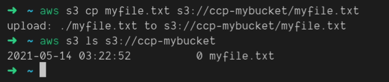

# AWS Access Keys, CLI and SDK

## Overview

Accessing AWS services is not limited to just the Management Console; there are three primary options available:

1. **Management Console:**
   - Web interface accessed through a browser.
   - Protected by a username, password, and possibly multifactor authentication (MFA).

2. **CLI (Command Line Interface):**
   - Set up on a local computer.
   - Protected by access keys, which are credentials downloaded from the Management Console.
   - Allows interaction with AWS services through command-line commands.
   - Direct access to the public APIs of AWS services.
   - Useful for scripting and automating tasks.
   - Open-source and an alternative to the Management Console.

1. **SDK (Software Development Kit):**
   - A set of libraries for different programming languages.
   - Embedded within application code to access and manage AWS services programmatically.
   - Requires access keys, similar to the CLI.
   - Supports languages like JavaScript, Python, PHP, .NET, Ruby, Java, Go, Node.js, C++, etc.
   - Mobile SDK available for Android and iOS, and IoT SDK for Internet of Things devices.

## Generating Access Keys

- Access keys are generated through the Management Console.
- Users are responsible for their access keys, and they are treated as secret credentials.
- Access key ID and secret access key are analogous to a username and password.
- Access keys should not be shared; each user generates their own.
- In the Management Console, users can create access keys and download them instantly.

   Example of access keys:
   - Access Key ID: `AKIAY123456789012345`
   - Secret Access Key: `AbCdEfGhIjKlMnOpQrStUvWxYz1234567890`

