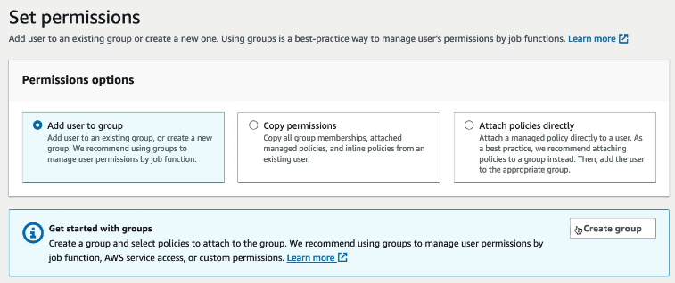
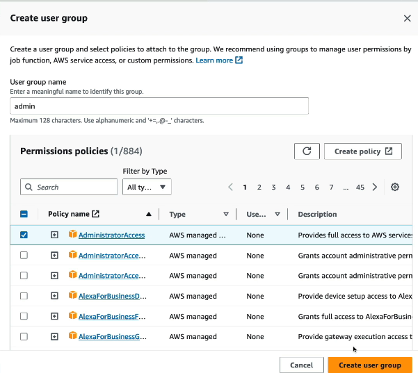

# AWS IAM User Creation Walkthrough

## Introduction
This README provides a step-by-step guide on creating IAM (Identity and Access Management) users in AWS. IAM is a crucial service for managing user access and permissions within the AWS environment.

- Why create users? Users are created to move away from using the root user for security reasons.

## Steps:

1. **Access IAM Console:**
   - Navigate to the AWS console.
   - In the search bar, type "IAM" and access the IAM console.

2. **User Creation:**
   - On the left-hand side, select "Users" to start creating IAM users.

3. **Global Service:**
   - Observe that IAM is a global service, and region selection is not applicable.

4. **Create IAM User:**
   - Provide a username (e.g., Bianca).
   - Choose to create an IAM user and set a password.

5. **Group Creation:**

    

   - Create an IAM group (e.g., admin) with a policy (e.g., administrator access).
    
   - Add the newly created user to the admin group.
    

6. **Review:**
   - Review user details, group permissions, and optional tags.

7. **Back to the IAM Dashboard:**
   - On the right side, under the AWS Account section you have the following:
    
   - Now you can customize this Sign-in URL very easily by creating what's called an **account alias**:
    

8. **Now to sign in using my account**
   - Create a new browser window in private mode to use two accounts at the same time.
    
   - Choose the IAM User.
   - Enter either the account ID or Account Alias.
   - Then use the login details from Step 4.