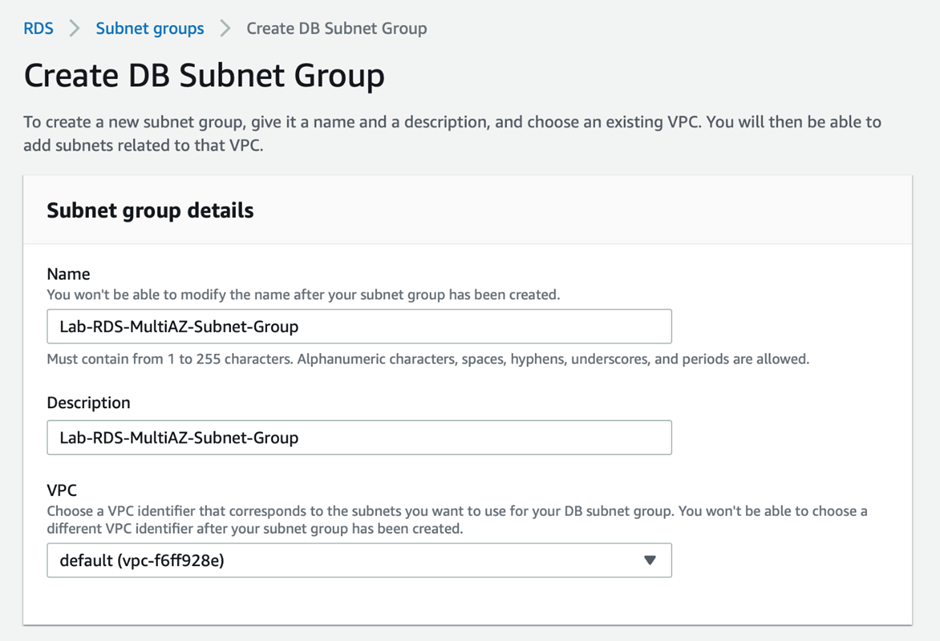
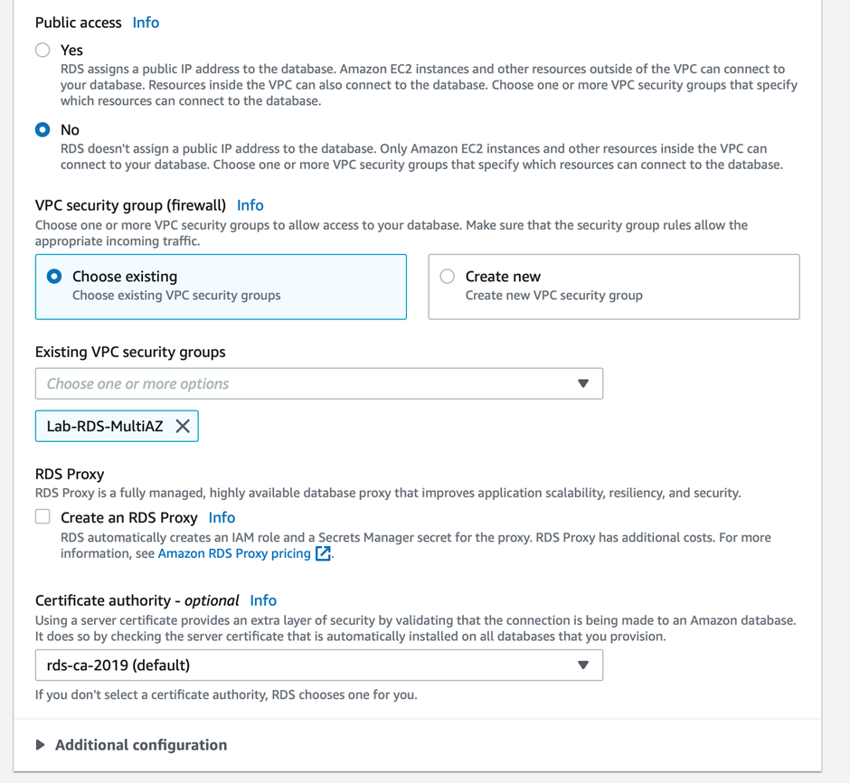

# Task 2: Provision RDS database instance in a Multi-AZ configuration for high availability and failover
-  This helps establish data redundancy, eliminate I/O freezes, and minimize latency spikes during system backups and planned system maintenance. The database with Multi-AZ configuration would be provisioned in two private subnet groups.

## 1. Enter VPC in the search bar and select VPC service. Select Subnets from the left sidebar and click Create subnet:

a)	You can create the first private subnet by filling in the Subnet name as Lab-Private-Subnet-A, select the Availability Zone as us-east-1a and enter the value for IPv4 CIDR block as 172.31.144.0/20

 
b)	You can create the second private subnet by filling in the Subnet name as Lab-Private-Subnet-B, select the Availability Zone as us-east-1b and enter the value for IPv4 CIDR block as 172.31.160.0/20
 
## 2.	Select Route Tables from the left sidebar:
- Click on the Create route table button 
- Enter Name as Lab-Private-RT and select your default VPC 
- Click on Create route table button 
- Select the route table you just created and select the Subnet associations tab 

- Click on Edit subnet associations button 
- Select the two private subnets that you created - Lab-Private-Subnet-A and Lab-Private-Subnet-B

- Click on Save associations button.
 
## 3.	Navigate to the RDS service on the AWS Management Console.
a.	Select subnet groups from the left sidebar and then click on Create DB Subnet Group. This DB subnet group will be used to launch the database in a private subnet

 
b.	For the DB Subnet Group, enter both the name and description as Lab-RDS-MultiAZ-Subnet-Group and select your default VPC

 
c.	Choose Availability Zones - us-east-1a and us-east-1b. Select the private subnets created in the step 1a and 1b above. Click on Create

 
## 4.	Navigate to the EC2 service on the AWS Management Console. Select Security groups from the left sidebar and click on the Create security group button

a.	Enter Security group name as Lab-RDS-MultiAZ, enter Description as Lab-RDS-MultiAZ and then select your default VPC

 
b.	Create an inbound rule for MySQL port 3306 with the allowed source only from the Security group Lab-EC2-web-ssh created for the EC2 Instance in Task 1. Click on the Create security group button

 
## 5.	Navigate to the RDS service on the AWS Management Console.
a.	Select Databases from the left sidebar and click on the Create database button

 
b.	Choose the database creation method as standard, engine option as MySQL

 
c.	Leave the Engine version value as unchanged

d.	Choose the Template as Dev/Test. Select the Availability and durability option as Multi-AZ DB instance

 
e.	Enter values for DB instance identifier, master username and master password

 
f.	In the Instance configuration section, choose the DB instance class as `Burstable classes` and select the value `db.t3.micro` from the dropdown. For the Storage section, select General Purpose SSD (gp2) as the Storage type and enter 20 GiB as the Allocated Storage. Leave the default values unchanged for the Storage autoscaling sub-section

 
g.	In the Connectivity section, choose the default VPC, select the `lab-rds-multiaz-subnet-group` for the subnet group

 
h.	In the Connectivity section again, for Public access, select `No`, as we want the database not to be accessible over the public internet. Select the VPC security group - Lab-RDS-MultiAZ - created in Step 4 above

 
i.	Select Password authentication as the option for Database authentication options. Leave the defaults unchanged for the Monitoring section. Click on Create database

j.	You should see that the database has been created successfully.
