# Task 5: Simulate RDS database instance failover to the standby database instance
- Will need to use the reboot with failover feature of RDS via the AWS management console to simulate RDS primary database instance failover to the standby database instance. Lastly, you need to use the event subscriptions feature of the RDS databases to get SNS notifications regarding the database failover to the standby.

## 1.	Make sure that you are in the N.Virginia AWS Region on the AWS Management. Console. Enter RDS in the search bar and select RDS service.
a.	Click on Event subscriptions on the left sidebar.
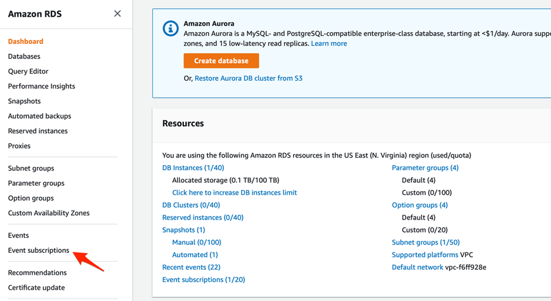
 
b.	Enter the event subscription name as `Lab-RDS-MultiAZ-Failover`. For the target, send notifications to a `New email topic`. Enter the topic name as `Lab-RDS-Failover-Notification` and fill in your email address as the recipient email address.
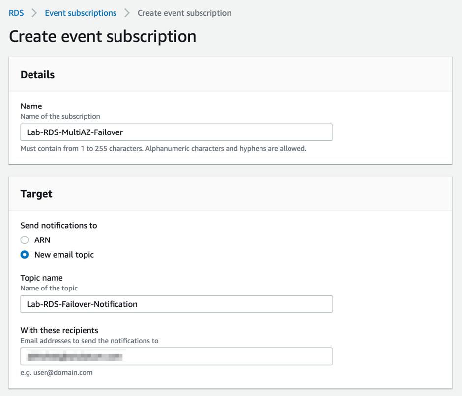
 
c.	For the Source section, select the source type as Instances. Select the database instance - database1 - created in Task 2 as the specific instance. Select failover as the specific event category for the notification. Click on Create.
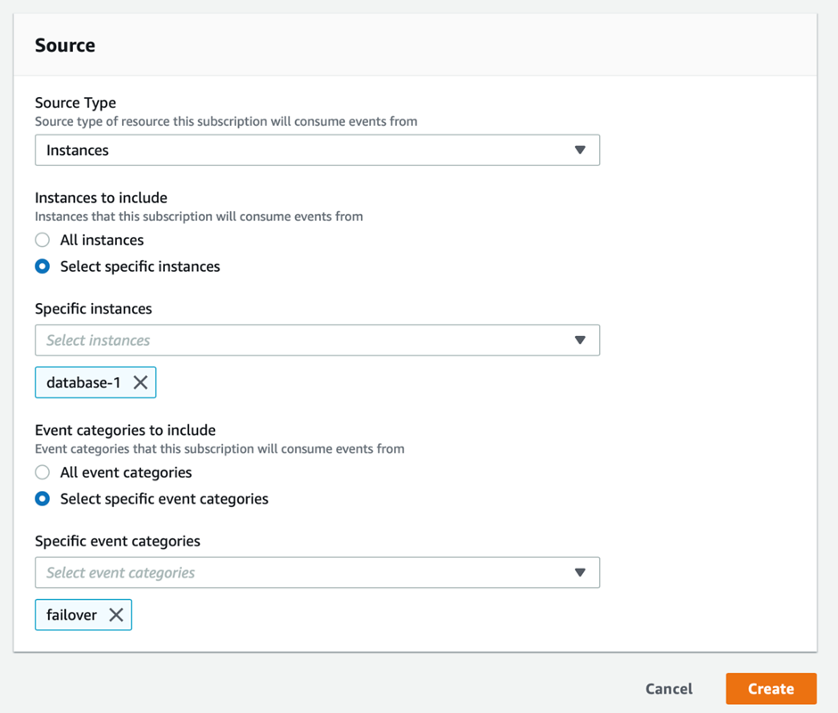
 
d.	Go to your inbox for the email address youve used in Step 1b above. Click on the Confirm subscription link in the email that you have received from AWS Notifications.
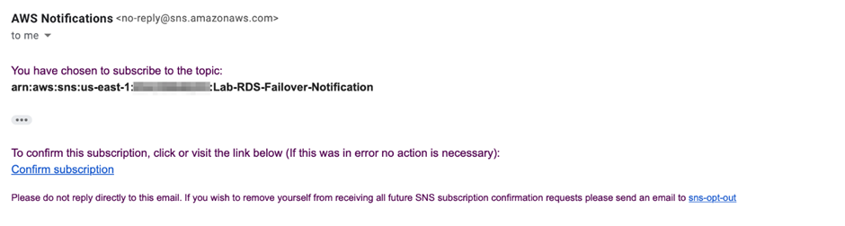

You should see a message that youve successfully subscribed to SNS Notifications.
 
e.	Navigate to the database instance - database-1 - created in Task 2. You should make a note of the existing Availability Zone of this database instance. Once we simulate the reboot with failover, you will notice that the Availability Zone has changed because the standby is located in a separate AZ for a Multi-AZ configuration.
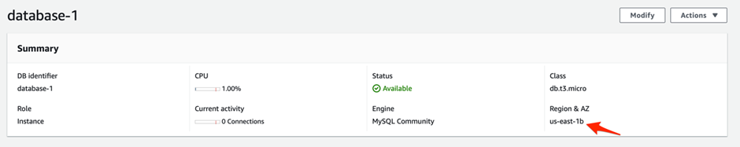
 
f.	Click on the Actions button and select Reboot.
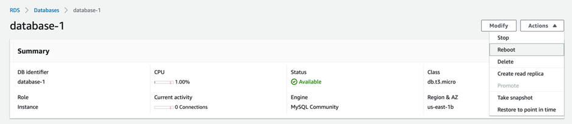
 
g.	Select the checkbox for Reboot with Failover. Click on Confirm.
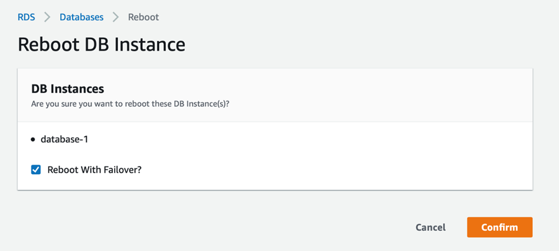
 
h.	The database status changes to Rebooting.
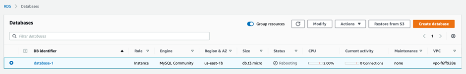
 
i.	As soon as the failover is complete, you will notice that the database instance is now located in a different Availability Zone.
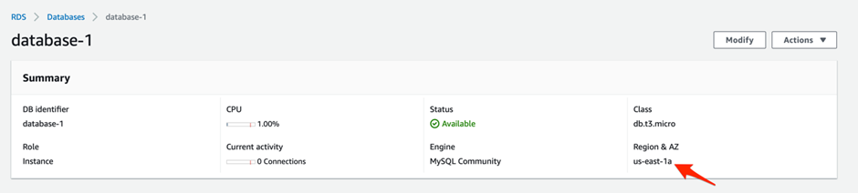
 
j.	You should also receive an email from SNS Notifications with the details of the failover events - failover started and failover completed.
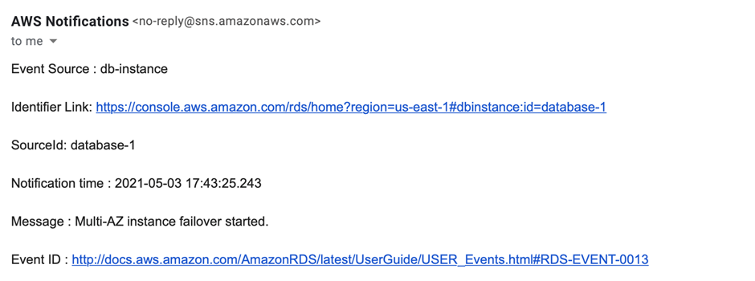
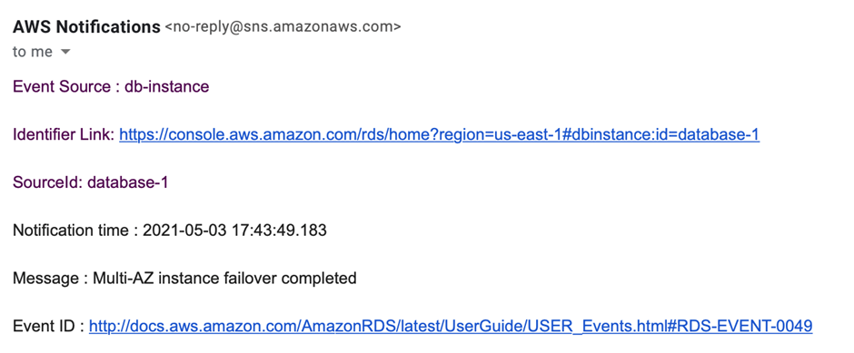
 
 

