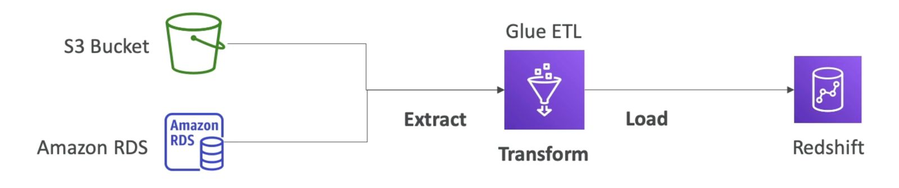

# AWS Glue Overview

AWS Glue is a managed Extract, Transform, and Load (ETL) service, designed to prepare and transform datasets for analytics. It is fully serverless, allowing users to focus on data transformation while Glue takes care of the underlying infrastructure.

## AWS Glue ETL Workflow

1. **Data Extraction:** Glue extracts data from sources like S3 and RDS.
2. **Data Transformation:** Users write scripts to transform the extracted data.
3. **Data Loading:** Transformed data is loaded into destinations like Amazon Redshift for analysis.

