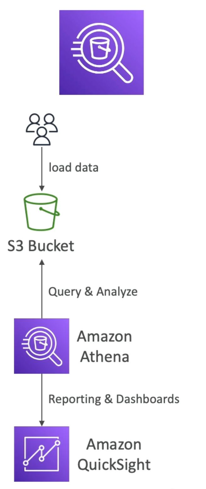

# Amazon Athena Overview

Amazon Athena is a serverless query service designed for analytics on objects stored in Amazon S3.

## Key Points about Amazon Athena

- **Query Service:** Athena allows you to perform SQL queries on data stored in Amazon S3 without the need to load it beforehand.
- **Supported Formats:** Data files in S3 can be in various formats like CSV, JSON, ORC, Avro, and Parquet.
- **Built on Presto Engine:** Athena is built on the Presto engine, enhancing its query capabilities.
- **Workflow:** Users load data into Amazon S3, and Athena is used to query and analyze the data, making the process simple.
- **Reporting Integration:** Optionally, you can use reporting tools like Amazon QuickSight on top of Athena for visualizing and reporting.
- **Pricing:** Athena's pricing is around $5 per terabyte of data scanned. Compression or columnar storage can result in cost savings.
  
## Use Cases

Athena is suitable for various use cases, including:
- Business intelligence, analytics, and reporting.

