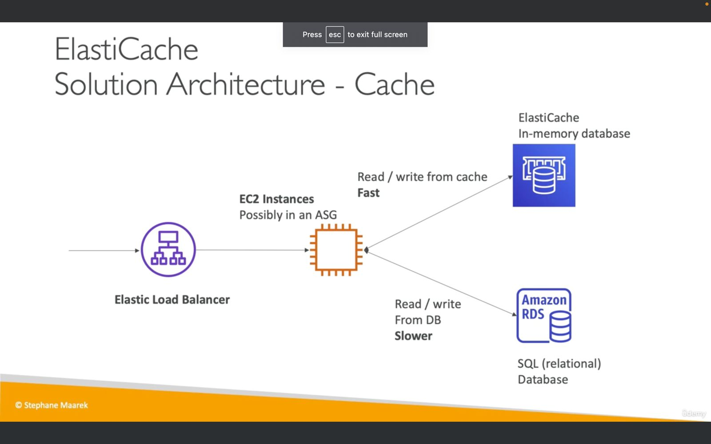

### 2. Amazon ElastiCache

- **Managed In-Memory Databases**: ElastiCache provides managed Redis or Memcached databases that operate in-memory, offering high performance and low latency.
- **Load Reduction**: ElastiCache is beneficial for reducing the load on databases with read-intensive workloads.
- **Managed Service Advantages**: AWS handles operating system maintenance, patching, optimizations, setup, configuration, monitoring, failure recovery, and backups for ElastiCache.

## Solution Architecture

- **Components**:
  - Elastic Load Balancer (ELB) directs traffic to EC2 Instances, possibly in an Auto Scaling Group (ASG).
  - EC2 Instances read and write data from the Amazon RDS database.
  - Cached values are stored in the Amazon ElastiCache in-memory database.

- **Objective**:
  - Relieve pressure from the slower Amazon RDS database by caching frequently accessed queries in the faster, in-memory ElastiCache database.