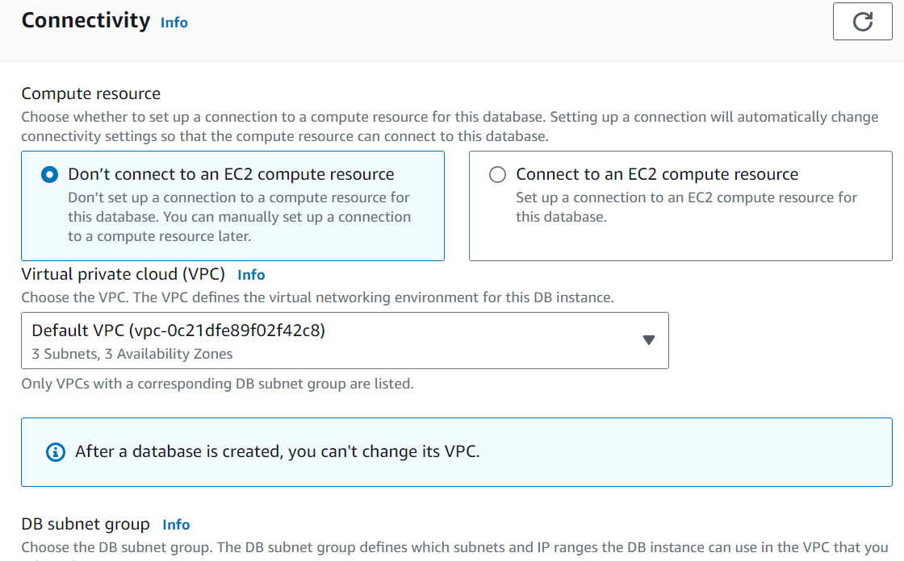

# Creating a Database in RDS

This section walks through the process of creating a database in RDS (Relational Database Service) on AWS. It provides a general overview of RDS and its functionalities.

## Overview of RDS

- **Interface Navigation**: In the AWS console, navigate to the "Databases" section on the left-hand side.
- **Create Options**: Two create options are available: "Standard Create" and "Easy Create."
  - "Easy Create": Uses recommended best-practice configurations.
  - "Standard Create": Allows customization of all settings.

## Standard Create Process

1. **Selecting Engine**: Choose the database engine from options such as Aurora, MySQL, MariaDB, PostgreSQL, Oracle, or Microsoft SQL Server.
2. **Template Selection**: Templates like Production, Dev/Test, or Free Tier are available. In this example, the Free Tier template is chosen:

1. **Configuration Details**:
   - **DB Identifier**: Set as "database-1."
   - **Master Username**: Chosen as "admin."
   - **Password**: Set and confirmed.
   - **Database Class**: T2 micro (Free Tier).
2. **Storage Configuration**:
   - Enable 20 gigabytes of gp2 SSD storage:

   - Storage autoscaling up to one terabyte:

1. **Connectivity Options**:
   - Specify VPC and subnet group:

   - Decide on public access (yes/no):

   - Assign security group:

1. **Authentication**:
   - Choose password authentication.
   - No additional configurations covered in this demo.

2. **Create Database**: Initiate the creation process.

## Conclusion

- Managed services like RDS simplify infrastructure management.
- ! Very much recommended to create a snapshot from your database for desaster recovery!
- Speed up cloud usage with features like easy configuration, monitoring, and snapshot management.
- For this hands-on, delete the snapshot and the database using the AWS console.

