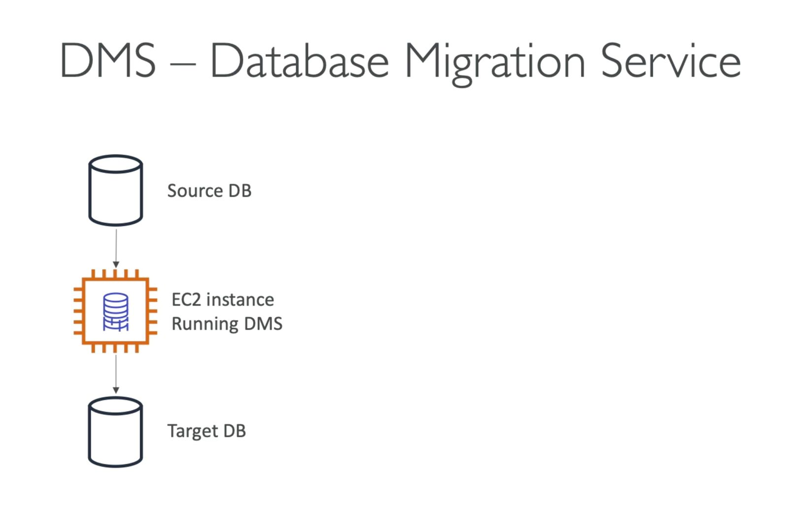

# AWS Database Migration Service (DMS) Overview

AWS Database Migration Service (DMS) is a solution for efficiently migrating data from one database to another within AWS.
  
## DMS Workflow

1. **Data Extraction:** Extracts data from the source database.
2. **DMS Software on EC2:** Runs DMS software on an EC2 instance to manage the migration process.
3. **Data Insertion:** Inserts the data into the target database.

