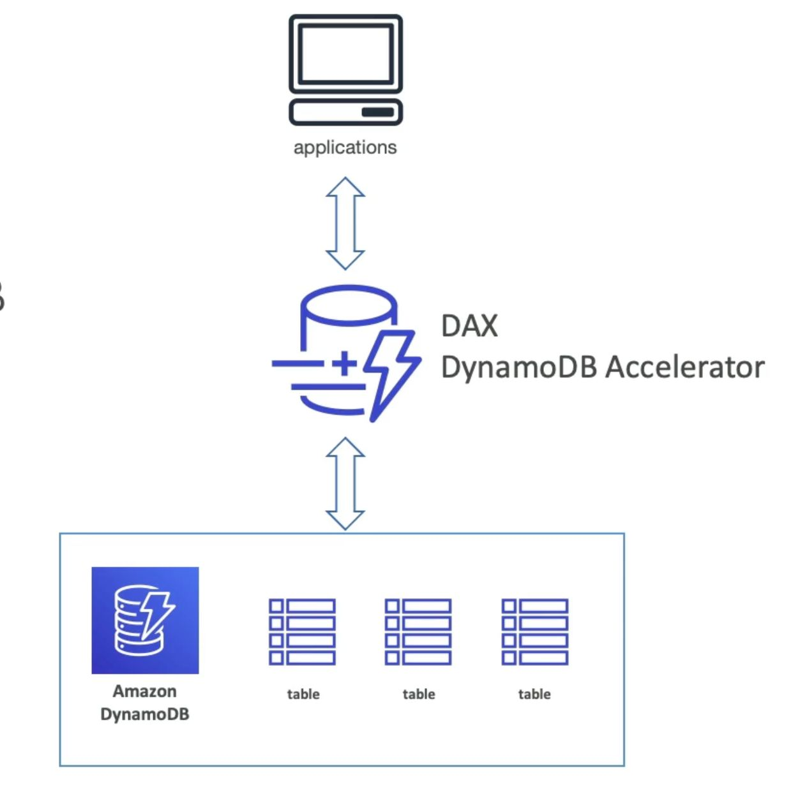

# NoSQL Databases

## Amazon DynamoDB: Fully Managed NoSQL Database, Low Latency Database

- **Serverless Architecture**: Unlike RDS or ElastiCache, DynamoDB is serverless, meaning there's no need to provision specific server instances.
- **Scalability**: Scales to handle millions of requests per second, trillions of rows, and hundreds of terabytes of storage.
- **Integration with IAM**: Integrated with AWS Identity and Access Management (IAM) for security, authorization, and administration.
- **Table Classes**: Provides standard and infrequent access (IA) table classes for cost savings based on data classification.

### DynamoDB - type of data

- **Key-Value Database**: DynamoDB utilizes a key-value data model with a primary key consisting of one or two columns: a partition key and a sort key.
- **Attributes**: Data is organized with attributes representing columns for each item in the table.

### DynamoDB Accelerator (DAX)

- **Integration with DynamoDB**: Fully integrated with DynamoDB, serving as a cache for frequently read objects.
- **DAX vs. ElastiCache**: DAX is exclusively used with DynamoDB, while ElastiCache is a general-purpose caching service applicable to various databases.

### DynamoDB Global Tables: Low-Latency Access Across Regions

- DynamoDB Global Tables enable DynamoDB tables to be accessed globally, providing low-latency access to data in multiple regions.
- Tables can be replicated across different AWS regions, ensuring the same data is available in each region.
- **Example Scenario**: Suppose we have a DynamoDB table in us-east-1. By setting it up as a global table, replication can be established with a table in Paris (eu-west-3), allowing users in the Paris region to access the table with low latency.

- **Active-Active Replication**: Users can read and write to the table in any region, making it an active-active replication scenario. Data written in one region is actively replicated to other regions.
- **Scalability**: Global Tables support replication across one to ten regions, offering scalability based on business needs.

## Amazon DocumentDB Overview

- **NoSQL Database:** DocumentDB is a NoSQL database, specifically designed for storing, querying, and indexing JSON data.
- **Compatibility with MongoDB:** It is compatible with MongoDB, allowing users familiar with MongoDB to work seamlessly.
- **Similar to Aurora:** DocumentDB follows a deployment concept similar to Aurora, providing a fully managed, highly available database.

## Exam Tips

- **Related to MongoDB:** Whenever MongoDB is mentioned in the exam, think of Amazon DocumentDB.
- **No SQL Databases:** If questions involve NoSQL databases, consider DocumentDB and DynamoDB.

