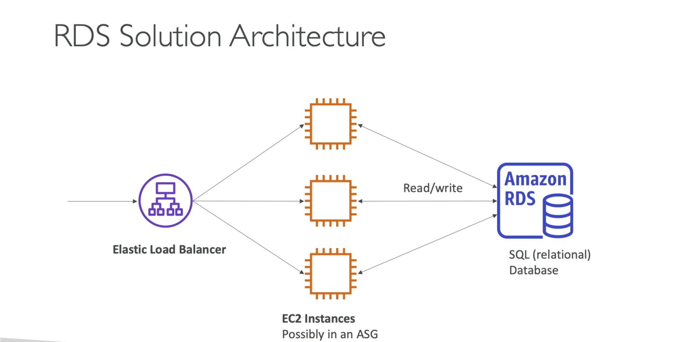

# Relational Databases: RDS and Aurora

## RDS (Relational Database Service)

- **Definition**: RDS is a managed database service designed explicitly for relational databases, utilizing the SQL language.
- **Managed Databases**: RDS automates the provisioning and management of databases in the cloud.
- **Supported Database Types**: RDS supports various relational database types, including PostgreSQL, MySQL, MariaDB, Oracle, Microsoft SQL Server, and the proprietary Aurora database.
- **Advantages Over EC2 Deployment**:
  - Continuous backups with point-in-time restore options.
  - Monitoring dashboards for performance insights.
  - Scalability through read replicas for improved read performance.
  - Multi-AZ setup for disaster recovery planning.
  - Maintenance windows for upgrades.
  - Vertical and horizontal scaling options.
- **Storage**: Backed by EBS (Elastic Block Store).
- **Limitation**: SSH access to RDS instances is not allowed; AWS manages the entire database.

### RDS in Solution Architecture

- RDS fits within a solution architecture where a load balancer fronts multiple backend EC2 instances.
- EC2 instances connect to a relational database (RDS) for structured data storage.
- Classic solution architecture with load balancer, EC2 instances, and database tier for reads and writes.

## Tutorials
[Creating a database in RDS](<Creating a Database in RDS.md>)

### Aurora

- **Definition**: Aurora is a proprietary database technology created by AWS, not open source.
- **Similarity to RDS**: Aurora works similarly to RDS, with EC2 instances connecting directly to Amazon Aurora.
- **Supported Database Technologies**: Aurora supports PostgreSQL and MySQL.
- **Performance**:
  - Cloud-optimized with a 5x performance improvement over MySQL on RDS.
  - 3x performance improvement over PostgreSQL on RDS.
- **Storage**:
  - Automatic and grows in increments of 10 gigabytes.
  - More efficient but around 20% more expensive than RDS.
- **Not Included in Free Tier**: Unlike RDS, Aurora is not part of the AWS free tier.

#### Aurora Serverless

- **Definition**: Aurora Serverless is a serverless option for Amazon Aurora, providing automated database instantiation and autoscaling based on usage.
- **Supported Database Engines**: Both PostgreSQL and MySQL are supported.
- **Advantages**:
  - No capacity planning required.
  - No server management, as AWS handles it.
  - Pay-per-second billing, potentially more cost-effective.
  - Ideal for infrequent, intermittent, or unpredictable workloads.

##### How Aurora Serverless Works

Clients connect to a proxy fleet managed by Aurora > Aurora instantiates database instances automatically based on scaling needs > Aurora databases share the same storage volume > Ideal for scenarios with no management overhead and unpredictable workloads.

## RDS Architectural Choices

### 1. RDS Read Replicas / 2. Multi-AZ Deployment

### 3. Multi-Region Deployment

