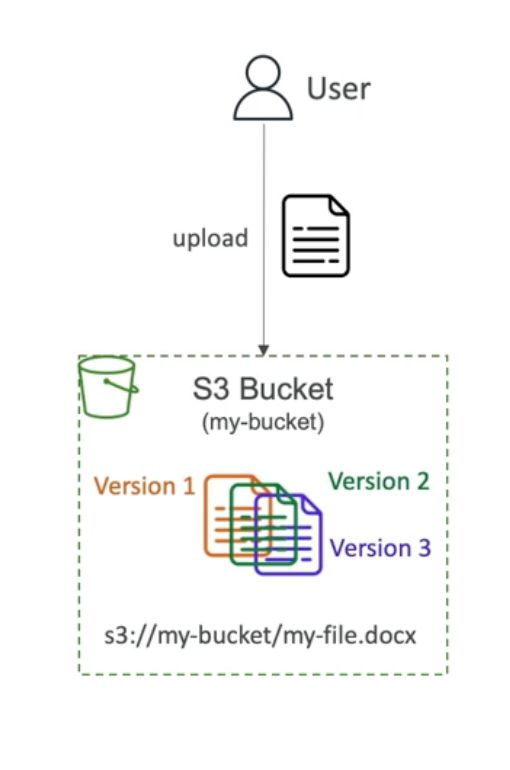

# Amazon S3 Versioning

- [Amazon S3 Versioning](#amazon-s3-versioning)
  - [Benefits of Versioning](#benefits-of-versioning)
  - [Best Practices](#best-practices)
  - [Example Scenario](#example-scenario)
- [Playing with S3 Versioning](#playing-with-s3-versioning)
  - [Enabling Versioning:](#enabling-versioning)
  - [Uploading an Updated File:](#uploading-an-updated-file)
  - [Viewing Object Versions:](#viewing-object-versions)
  - [Rolling Back to a Previous Version:](#rolling-back-to-a-previous-version)
  - [Deleting Objects with Delete Markers:](#deleting-objects-with-delete-markers)
  - [Restoring a Deleted Object:](#restoring-a-deleted-object)

Amazon S3 supports versioning, allowing you to keep multiple versions of an object in a bucket. Here's an overview of versioning in Amazon S3:

## Benefits of Versioning

1. **Protection Against Unintended Deletes:**
   - Deleting a file with versioning creates a delete marker but doesn't permanently remove the file.
   - You can restore versions that were previously deleted.

2. **Rollback to Previous Versions:**
   - Easily roll back to a previous version of a file.
   - Useful for recovering from unintended changes.

3. **Notes:**
   - Files not versioned prior to enabling versioning will have the version set to null.
   - Suspending versioning doesn't delete previous versions; it's a safe operation.

## Best Practices

- It is a best practice to enable versioning for buckets, providing additional data protection.
- Versioning enhances data durability and helps recover from accidental data loss or changes.

## Example Scenario

Imagine you have an HTML file (index.html) in your S3 bucket. Enabling versioning allows you to track changes over time. If someone accidentally overwrites the file, you can easily revert to a previous version.

# Playing with S3 Versioning

Let's explore Amazon S3 versioning and how it helps manage changes and recover previous versions of objects in a bucket.

## Enabling Versioning:

1. Navigate to the S3 bucket properties.
2. Edit the bucket versioning settings and enable versioning.

## Uploading an Updated File:

1. Access the S3 bucket containing the website files.
2. Locate the file to update (e.g., `index.html`).
3. Edit the file content and upload it as a new version.

## Viewing Object Versions:

1. Toggle the "Show versions" option in the S3 console.
2. Observe that files uploaded before versioning was enabled have a null version ID.
3. Updated files have distinct version IDs.

## Rolling Back to a Previous Version:

1. To roll back to a previous version, click on the specific version ID of the file.
2. Confirm that "Show versions" is enabled.
3. Delete the version using the "permanently delete" option.
4. Refresh the webpage to see the content revert to the previous version.

## Deleting Objects with Delete Markers:

1. Deleting an object adds a delete marker but doesn't permanently delete the version.
2. Observe the delete marker with a version ID.
3. Attempting to access the object after deletion shows a "404 Not Found" error.

## Restoring a Deleted Object:

1. Click on the delete marker in the S3 console.
2. Permanently delete the delete marker to restore the previous version of the object.
3. Refresh the webpage to confirm that the object is restored.
